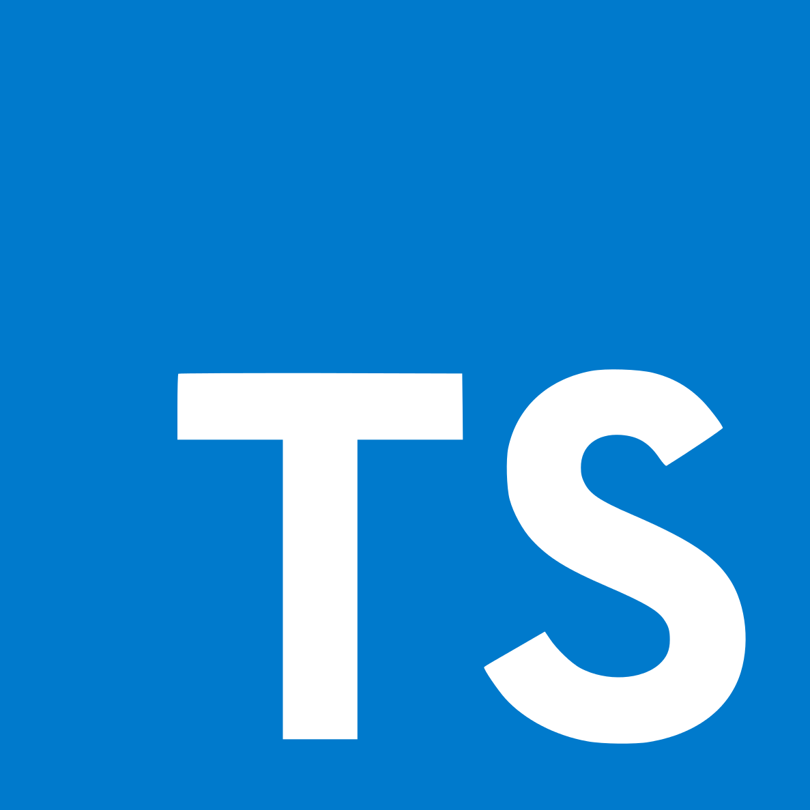
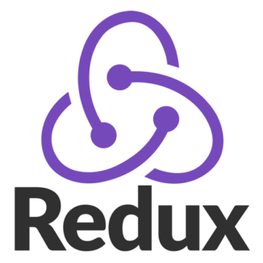

<br />
<p align="center">
  <a href="https://bugvilla.herokuapp.com">
    
  </a>

  <h3 align="center">Track, Manage & Kill Bugs Effectively</h3>

  <p align="center">
    
    <a href="https://www.codacy.com?utm_source=github.com&amp;utm_medium=referral&amp;utm_content=anuraghazra/BugVilla&amp;utm_campaign=Badge_Grade"></a>
    
    
  </p>

  <p align="center">
    <a href="https://bugvilla.herokuapp.com">View Demo</a>
    ·
    <a href="https://github.com/anuraghazra/BugVilla/issues">Report Bug</a>
    ·
    <a href="https://github.com/anuraghazra/BugVilla/issues">Request Feature</a>
  </p>
</p>

<p align="center">Universal bug tracker for everyone! BugVilla allows team members to collaborate, discuss and kill bugs effectively.</p>

## ✨ Features

- Issue discussions
- Markdown support
- Comment reactions
- Social interactions
- User reputation system
- \# Reference other bugs
- @ Mentions users
- Notifications
- Bug labels

## Tech Stack

| Stack    | -                                                                                                  | -                                                                                                 | -                                                                                                | -                                                                                                                | -                                                                                                   |
| -------- | -------------------------------------------------------------------------------------------------- | ------------------------------------------------------------------------------------------------- | ------------------------------------------------------------------------------------------------ | ---------------------------------------------------------------------------------------------------------------- | --------------------------------------------------------------------------------------------------- |
| FrontEnd | <p align="center"> <br />Reactjs</p> | <p align="center"> <br />Typescript</p>  | <p align="center"> <br />Redux</p>   | <p align="center"> <br />Styled Components</p> | <p align="center"> <br />Cypress</p>       |
| BackEnd  | <p align="center"> <br />Nodejs</p>   | <p align="center"> <br />MongoDB</p> | <p align="center"> <br />Heroku</p> | <p align="center"> <br />Express</p>               | <p align="center"> <br />Socket.io</p> |


## :rocket: Quick start

Start developing locally.

### Step 1: Clone the repo
Fork the repository. then clone the repo locally by doing -

```sh
git clone https://github.com/anuraghazra/BugVilla.git
```

### Step 2: Install Dependencies
cd into the directory

```sh
cd BugVilla
```

In the root folder do npm install.
```sh
npm install
# also in client
cd client & npm install
```

### Step 3: Setup .env
To run the server you will also need to provide the `.env` variables

- create a new file .env in the root
- open [.env.EXAMPLE](./.env.EXAMPLE)
- copy the contents and paste it to the .env with valid keys

#### And you are good to go
```sh
npm run develop
```


## :open_file_folder: What's inside?

A quick look at the folder structure of this project.
    
    .
    ├── client
    |   ├─cypress
    |   ├─public
    │   └─src
    │     ├───@bug-ui
    │     ├───assets
    │     ├───components
    │     ├───hooks
    │     ├───pages
    │     ├───store
    │     ├───styles
    │     ├───utils
    │     └───__tests__
    └── server
        │
        ├───controllers
        ├───middleware
        ├───models
        ├───routes
        ├───tests
        └───utils
      
## :v: Contributing

After cloning & setting up the local project you can push the changes to your github fork and make a pull request.

> You can also run the tests locally to see if everything works fine with

### Running tests
```bash
npm run test
npm run cy:open
```

### Pushing the changes

```bash
git add .
git commit -m "feat: added new stuff"
git push YOUR_REPO_URL develop
```

------

Made with :heart: and javascript
