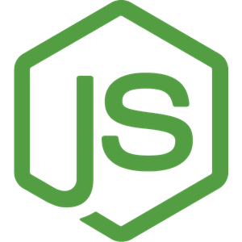

 

  

  <h3 align="center">Feature Rich Bug Tracker</h3>

  

    <a href="https://bugvilla.herokuapp.com">View Demo</a>
    ·
    <a href="https://github.com/othneildrew/Best-README-Template/issues">Report Bug</a>
    ·
    <a href="https://github.com/othneildrew/Best-README-Template/issues">Request Feature</a>
  

## Features

- Issue discussions
- Comment Reactions
- Social Interactions
- User Reputation System
- #Reference other bugs
- @Mentions users
- Notifications
- Bug Labels

## Tech Stack

| FrontEnd                                                                                                                    | BackEnd                                                                                                        |
| --------------------------------------------------------------------------------------------------------------------------- | -------------------------------------------------------------------------------------------------------------- |
| 
  Reactjs
                   | 
  Nodejs
      |
| 
  Typescript
                   | 
  MongoDB
    |
| 
  Redux
                   | 
  Heroku
    |
| 
  Styled Components
 | 
  Express
   |
| 
  Cypress
                    | 
  Socket.io
 |

- FrontEnd
